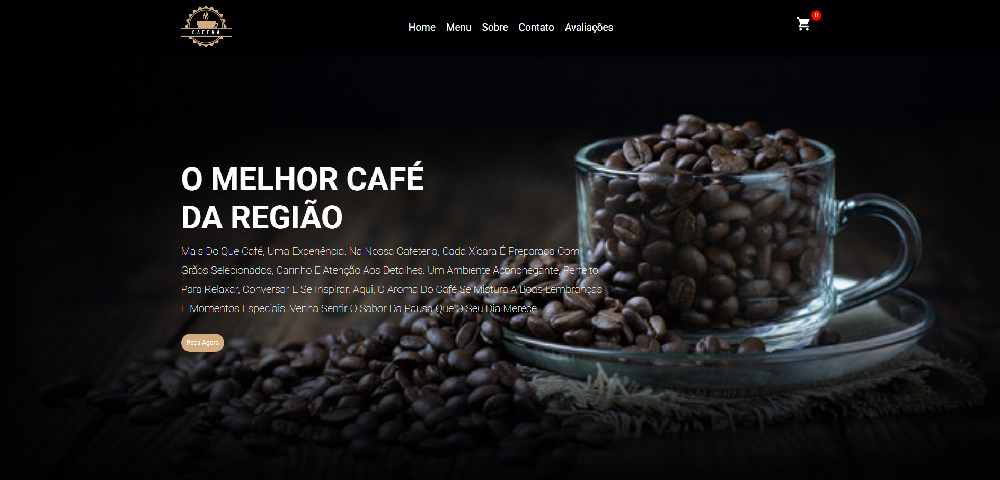

# ☕ Café no Ponto

Projeto de site de cafeteria desenvolvido com foco em prática de **Front-End**, utilizando HTML, CSS e JavaScript.

---

## 🚀 Tecnologias utilizadas

* HTML5
* CSS3
* JavaScript

---

## 🎯 Objetivo

Este projeto foi criado para aprimorar habilidades em desenvolvimento web, incluindo:

* Estruturação de páginas com HTML
* Estilização com CSS
* Interatividade com JavaScript

---

## 🌐 Acesse o projeto

👉
 https://ricardomartins33.github.io/Cafe-no-ponto/

📸 Preview

## 👨‍💻 Autor

**Ricardo Martins**

---
